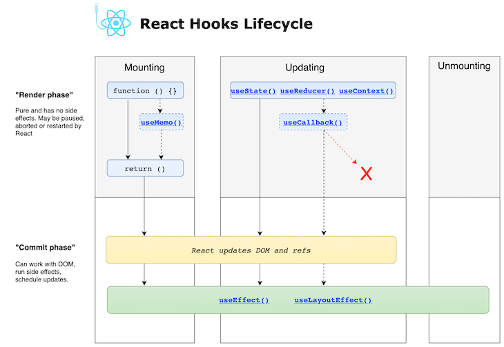

# React useEffect

The Effect Hook lets you perform side effects in function components:

## Understanding Side Effects

React is centered around functional programming. A side effect is any execution that affects something outside the scope of the function being executed. It is not a React specific term, it’s a general concept about the behavior of a function. For example, if a function modifies a global variable, then that function is introducing a side effect — the global variable doesn’t belong to the scope of the current function.

Some examples of side effects in React components are:

- Making asynchronous API calls for data
- Setting a subscription to an observable
- Manually updating the DOM element
- Updating global variables from inside a function

Side effects are often unavoidable if we want to make components perform the required task. Say we require a component that fetches data for the current user. In order to create this, we need to make an AJAX call to fetch the data for the specified user, hence we’re introducing the side effect to the function. Even if they are called side effects, you need them inside your components for them to accomplish the required tasks.

## Using effects

React provides another “hook” like `useState()` for running side-effects after your component renders. It’s called `useEffect()`. It takes a function as an argument, which will be run after every render (by default).

We will walk through the workshop trying to change document title to reflect the counter we have, our component basically has a counter as a state as follows

```jsx
function Counter(props) {
  const [count, setCount] = React.useState(0);

  return <button onClick={() => setCount(count + 1)}>Count is {count}</button>;
}
```

What we want to achieve is to change document title, which is an effect we manipulate, any thoughts 🤔 ?

OKAY, So lets introduce [useEffect hook](https://reactjs.org/docs/hooks-reference.html#useeffect)

### useEffect

```js
useEffect(didUpdate);
```

> Accepts a function that contains imperative, possibly effectful code.

try to implement that in our component knowing that `didUpdate` is a function

```jsx
function Counter(props) {
  const [count, setCount] = React.useState(0);

  useEffect(() => {
    document.title = `Count: ${count}`;
  });

  return <button onClick={() => setCount(count + 1)}>Count is {count}</button>;
}
```

lets trace the code above to figure out when `useEffect` runs, adding console inside function body.

```jsx
function Counter(props) {
  const [count, setCount] = React.useState(0);
  const [name, setName] = React.useState("Lina");

  useEffect(() => {
    document.title = `Count: ${count}`;
    console.log("use effect running");
  });

  console.log("rendering phase");

  return (
    <>
      <button onClick={() => setCount(count + 1)}>Count is {count}</button>
      <input value={name} onChange={(e) => setName(e.target.value)} />
    </>
  );
}
```

What can we figure? **By default, effects run after every completed render**.
Even when `name` value changed is it's not related to `count` in any way, but you can choose to fire them only when certain values have changed.

---

### Conditionally firing an effect

The default behavior for effects is to fire the effect after every completed render. That way an effect is always recreated if one of its dependencies changes.

If your effect does something expensive/slow like fetching from an API (or sorting a massive array etc) then this could be a problem and overkill in some cases.

To skip effects run on every render we need to pass a second argument to useEffect that is the array of values that the effect depends on.

```js
useEffect(didUpdate, arrayOfDependency);
```

Our updated example now looks like this:

```jsx
function Counter(props) {
  const [count, setCount] = React.useState(0);
  const [name, setName] = React.useState("Lina");

  useEffect(() => {
    document.title = `Count: ${count}`;
    console.log("use effect running ");
  }, [count]);

  console.log("rendering phase");

  return (
    <>
      <button onClick={() => setCount(count + 1)}>Count is {count}</button>
      <input value={name} onChange={(e) => setName(e.target.value)} />
    </>
  );
}
```

 <details>
        <summary>What this mean?</summary>
            <p> 
            In the example above, we pass [count] as the second argument. What does this mean? If the count is 5, and then our component re-renders with count still equal to 5, React will compare [5] from the previous render and [5] from the next render. Because all items in the array are the same (5 === 5), React would skip the effect. That’s our optimization.
 When we render with count updated to 6, React will compare the items in the [5] array from the previous render to items in the [6] array from the next render. This time, React will re-apply the effect because 5 !== 6. If there are multiple items in the array, React will re-run the effect even if just one of them is different.
        </p>
    
</details>

---

### Running Effect On Mounting phase or for the first render

As we can notice in the previous example we were running effect in every count update in addition to the first render, even if count doesn't updated.

Now let's think together what if I want to add timers to count dynamically every 2s, without the need to have a button to set count value.

Obviously we need to `setInterval` once in the first render.

```jsx
function Counter(props) {
  const [count, setCount] = React.useState(0);
  const [name, setName] = React.useState("Lina");

  useEffect(() => {
    setInterval(() => {
      setCount((prevCount) => prevCount + 1);
    }, 2000);
    console.log("use effect running");
  }, []);

  console.log("rendering phase");

  return (
    <>
      <p>Count is: {count}</p>
      <input value={name} onChange={(e) => setName(e.target.value)} />
    </>
  );
}
```

Passing an empty array tell react to run effect only once after the first render, this is what we call as `Mounting`.

---

### Cleaning up effects

Some effects need to be “cleaned up” if the component is removed from the page. For example timers need to be cancelled and global event listeners need to be removed. Otherwise you’d have a bunch of code running in the background trying to update a component that doesn’t exist anymore.

```jsx
function Counter(props) {
  const [count, setCount] = React.useState(0);
  const [name, setName] = React.useState("Lina");

  useEffect(() => {
    const timerID = setInterval(() => {
      setCount((prevCount) => prevCount + 1);
    }, 2000);
    console.log("use effect running");
    const cleanup = () => {
      clearInterval(timerID);
    };
    return cleanup;
  }, []);

  console.log("rendering phase");

  return (
    <>
      <p>Count is: {count}</p>
      <input value={name} onChange={(e) => setName(e.target.value)} />
    </>
  );
}

function CounterController() {
  const [displayCounter, setDisplayCounter] = React.useState(true);

  return (
    <>
      <button onClick={() => setDisplayCounter(!displayCounter)}>
        Toggle Counter
      </button>
      {displayCounter && <Counter />}
    </>
  );
}
```

The clean-up function runs before the component is removed from the UI to prevent memory leaks. Additionally, if a component renders multiple times (as they typically do), **the previous effect is cleaned up before executing the next effect**. In our example, this means the timer will be removed when the component is unmounted (removed from the UI).

---

### General notes:

- The useEffect will always run on the initial render.
- We can control the Effect using the second param
  - `useEffect(cb)` —> By default, it runs both after the first render and after every update
  - `useEffect(cb, [])` —> Runs on mounting only (once)
  - `useEffect(cb, [prop1, state])` —> Runs when one of the dependency changes
- Cleanup function will always runs before useEffect on re-render
- If you used React classes and lifecycle methods then useEffect will replace the three methods `componentDidMount` , `componentDidUpdate` , `componentWillUnmount`.
- You can use [linter rules](https://reactjs.org/docs/hooks-rules.html#eslint-plugin) to help you with the dependency array(this is included by default with [CRA](https://create-react-app.dev/))

## React Hook Life Cycle



## useEffect hook and class component methods

 <details>
        <summary>Come Back after react classes</summary>
            <h4>  Timing of effects</h4>
    <p>
   
Unlike `componentDidMount` and `componentDidUpdate`, the function passed to `useEffect` fires **after layout and paint**, during a deferred event. This makes it suitable for the many common side effects, like setting up subscriptions and event handlers, because most types of work shouldn’t block the browser from updating the screen.

However, not all effects can be deferred. For example, a DOM mutation that is visible to the user must fire synchronously before the next paint so that the user does not perceive a visual inconsistency. (The distinction is conceptually similar to passive versus active event listeners.) For these types of effects, React provides one additional Hook called `useLayoutEffect`. It has the same signature as `useEffect`, and only differs in when it is fired.

Additionally, starting in **React 18**, the function passed to **useEffect will fire synchronously before layout and paint** when it’s the result of a discrete user input such as a **click**, or when it’s the result of an update wrapped in **flushSync**. This behavior allows the result of the effect to be observed by the event system, or by the caller of `flushSync`

</p>

</details>

## Exercises

**_Exercise 1:_**

This exercise will be another way to show you the benefit of returning the cleanup function:

1. Create a `count` state using `useState` hook.
2. Use any JSX tag to show the count value on the screen(ex: p, span,...).
3. Create a function called `incrementCount` and call `setCount` inside it which will increase the `count` state by one.(don't forget to pass a callback function to `setCount` so you could have access to the old count value).
4. Now call `useEffect` hook and inside it add an event listener on the `document` with the event `mousedown` and pass `incrementCount` function as an event handler.
5. Now that everything is set try to run your application and see what it is happening. (_[mousedown](https://developer.mozilla.org/en-US/docs/Web/API/Element/mousedown_event)_)
   - This is happening because we are adding a new event listener with each re-render on the component and all of them will be triggered by the `mousedown` event.
6. Let's fix this by returning the cleanup function from our `useEffect` which will be used to remove our last event listener before re-rendering the component again.
7. Now it is fixed 🎉

---

**_Exercise 2:_**

Try to create this effect
_Hints_:

- use the dom `mousemove` eventListener, and don't forget to remove it with clean up.
- you can measure the window `innerWidth` and if mouseX is bigger than the half then apply `tomato` color and if not apply `blue` color.


---

## References

- [Using the effect hook](https://reactjs.org/docs/hooks-effect.html)
- [Hooks API reference - useEffect](https://reactjs.org/docs/hooks-reference.html#useeffect)
- [Guide to react useEffect hook](https://blog.logrocket.com/guide-to-react-useeffect-hook/)
